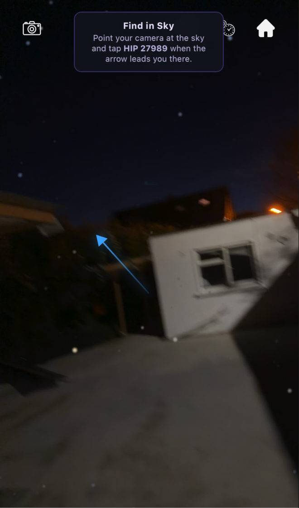
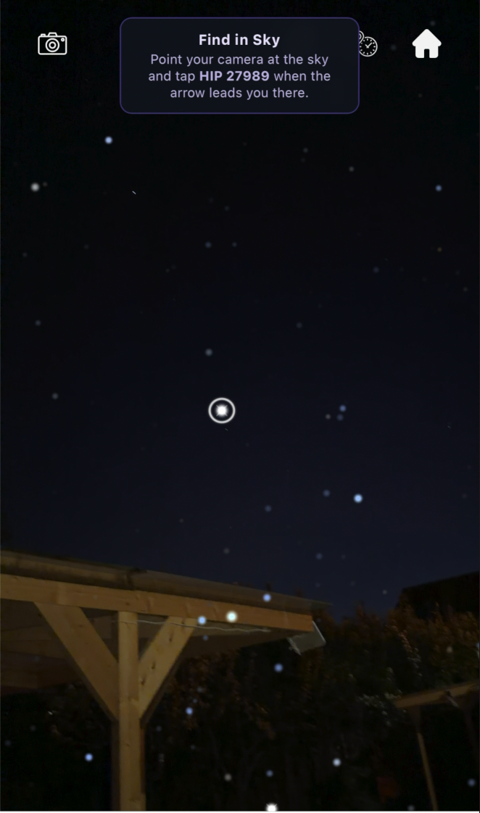
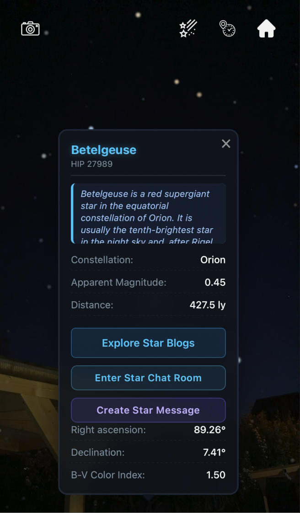
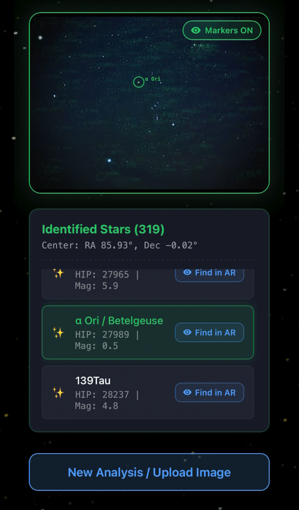
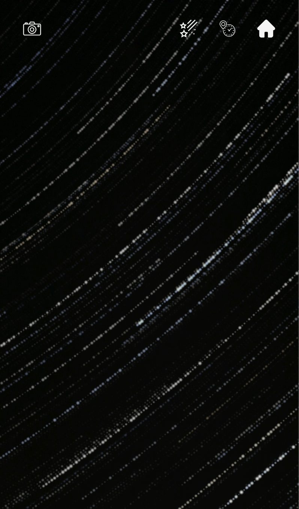

# Star Roll

[English](./readme.md) | 中文

**StarRoll** 是一款基于依巴谷星表（HIP 编号）构建的移动端观星应用。把手机举向天空，即可探索 AR 实时星图、拍照识别星星，并与其他观星爱好者互动——每个博客、聊天室和留言都锚定在一颗真实的恒星上。

## 应用预览

**AR 找星** —— 箭头引导你转向目标星，目标进入视野后自动高亮，点击即可查看星星详情卡片：

| 1. 跟随箭头 | 2. 目标星高亮 | 3. 星星详情 |
| :---: | :---: | :---: |
|  |  |  |

**拍照识星与星轨模拟**：

| 拍照识星 | 星轨模拟 |
| :---: | :---: |
|  |  |

## 功能特性

- **AR 实时星图** —— 相机实时取景叠加当前时刻的真实星空（恒星、星座连线、星云背景），由 GPS、设备方向传感器和天文坐标变换驱动。支持时间旅行（固定/加速时间）与自定义观测位置。
- **星轨模拟** —— 生成长曝光风格的星轨照片，可配置时长、拍摄间隔与亮度等参数。
- **拍照识星** —— 上传星空照片，通过自部署的 [astrometry.net](http://astrometry.net/) 盲解星图引擎识别照片中的恒星，并在原图上标注结果。
- **搜索与找星引导** —— 按常用星名搜索，屏幕箭头实时引导你在 AR 中转向目标星。
- **星星留言（星语）** —— 对一颗星留下一句话并通过链接分享，对方在 AR 中找到那颗星即可查看留言。
- **星星博客** —— 每颗星拥有自己的博客区，支持发帖、点赞、评论、收藏与举报。
- **星空聊天室** —— 每颗星对应一个 WebSocket 实时聊天室，基于 Redis Pub/Sub 与 Kafka 实现。
- **用户系统与成就** —— 注册、JWT 登录、邮箱验证码重置密码、资料编辑，以及星星发现段位（新手 → 探索者 → 天文学家 → 星辰领主）。
- **观星推荐** —— 结合天气与光污染数据，定期邮件推荐附近最佳观测点。

## 系统架构

```
客户端（Vue 3 + Three.js）
   │ REST（OpenAPI 契约）        │ WebSocket（聊天）
   ▼                            ▼
Console 服务（FastAPI，多实例）
   ├── MySQL          —— 用户、博客、聊天、任务、发现记录
   ├── Redis          —— 验证码缓存、聊天 Pub/Sub
   ├── Kafka          —— 聊天消息异步落库
   ├── MinIO / S3     —— 图片对象存储
   └── astrometry.net —— 盲解星图
Cronjob 服务
   ├── 识星任务调度
   └── 观星推荐邮件
```

**功能架构**：


**技术架构**：


全部 HTTP 接口以 [`idl/openapiv3.yaml`](./idl/openapiv3.yaml) 为单一事实来源，服务端骨架（python-fastapi）与客户端 SDK（typescript-fetch）均由其生成。

## 快速开始

- 开发流程与代码生成：[`for_developer_zh.md`](./for_developer_zh.md)
- 后端架构、规范与本地环境搭建（MySQL / Redis / Kafka / MinIO / astrometry.net）：[`backend/for_backend_developer.md`](./backend/for_backend_developer.md)
- Kubernetes 部署指南：[`k8s/readme_zh.md`](./k8s/readme_zh.md)

### 前端

```bash
cd frontend/vue-app
npm install
npm run dev
```

### 后端

```bash
pip install -r backend/requirements.txt
# 配置 .env 后启动 console 服务（详见后端文档）
```

## 贡献者

- Qiming Cao
- Songcheng Gao
- Yuhui Cao
- Sahil Sabir
- Kehan Liu
- Tianlai Gu
- Huafu Fang
- Shuyu He
